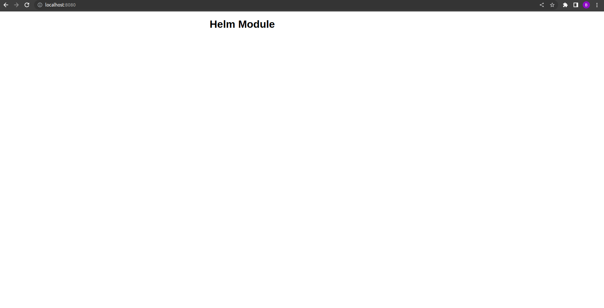

### **Task :**

https://github.com/infracloudio/citadel-internal/tree/master/workshops/helm#tasks-3

---

1. Creating configmap template configmap.yaml:
    ```bash
    apiVersion: v1
    data:
      index.html: |
        <!DOCTYPE html>
        <html>
        <head>
        <title>Helm Module</title>
        <style>
        html { color-scheme:light dark; }
        body { width: 35em; margin: 0 auto; font-family: Tahoma, Verdana, Arial, sans-serif; }
        </style>
        </head>
        <body>
        <h1>Helm Module</h1>
        </body>
        </html>
    kind: ConfigMap
    metadata:
      name: {{ .Release.Name }}-nginx-configmap
    ```

2. Created deployment template deployment.yaml:
    ```bash
    apiVersion: apps/v1
    kind: Deployment
    metadata:
      name: {{ include "mychart.fullname" . }}-nginx
      labels:
        {{- include "mychart.labels" . | nindent 4 }}
    spec:
      selector:
        matchLabels:
          app: nginx
      replicas: 1
      template:
        metadata:
          labels:
            app: nginx
        spec:
          containers:
          - name: nginx
            image: {{ .Values.image.repository }} 
            ports:
            - containerPort: 80
            volumeMounts:
            - name: index-file
              mountPath: /usr/share/nginx/html/
          volumes:
          - name: index-file
            configMap:
              name: {{ .Release.Name }}-nginx-configmap
    ```
3. Validated and installed chart :
    > Validation
    ```bash
    bhagyesh@BHAGYESH-SONI:~/helm_assignment/task-4_chart_templating$ helm template mychart/
    ---
    # Source: mychart/templates/configmap.yaml
    apiVersion: v1
    data:
      index.html: |
        <!DOCTYPE html>
        <html>
        <head>
        <title>Helm Module</title>
        <style>
        html { color-scheme:light dark; }
        body { width: 35em; margin: 0 auto; font-family: Tahoma, Verdana, Arial, sans-serif; }
        </style>
        </head>
        <body>
        <h1>Helm Module</h1>
        </body>
        </html>
    kind: ConfigMap
    metadata:
      name: release-name-nginx-configmap
    ---
    # Source: mychart/templates/deployment.yaml
    apiVersion: apps/v1
    kind: Deployment
    metadata:
      name: release-name-mychart-nginx
      labels:
        helm.sh/chart: mychart-0.1.0
        app.kubernetes.io/name: mychart
        app.kubernetes.io/instance: release-name
        app.kubernetes.io/version: "1.16.0"
        app.kubernetes.io/managed-by: Helm
    spec:
      selector:
        matchLabels:
          app: nginx
      replicas: 1
      template:
        metadata:
          labels:
            app: nginx
        spec:
          containers:
          - name: nginx
            image: nginx 
            ports:
            - containerPort: 80
            volumeMounts:
            - name: index-file
              mountPath: /usr/share/nginx/html/
          volumes:
          - name: index-file
            configMap:
              name: release-name-nginx-configmap
    ```

    > Installation
    ```bash
    bhagyesh@BHAGYESH-SONI:~/helm_assignment/task-4_chart_templating$ helm install mychart-nginx ./mychart/
    NAME: mychart-nginx
    LAST DEPLOYED: Fri Dec  2 15:48:38 2022
    NAMESPACE: default
    STATUS: deployed
    REVISION: 1
    TEST SUITE: None
    NOTES:
    1. Get the application URL by running these commands:
      export POD_NAME=$(kubectl get pods --namespace default -l "app.kubernetes.io/name=mychart,app.kubernetes.io/instance=mychart-nginx" -o jsonpath="{.items[0].metadata.name}")
      export CONTAINER_PORT=$(kubectl get pod --namespace default $POD_NAME -o jsonpath="{.spec.containers[0].ports[0].containerPort}")
      echo "Visit http://127.0.0.1:8080 to use your application"
      kubectl --namespace default port-forward $POD_NAME 8080:$CONTAINER_PORT
    ```

4. Examined the resource created and port-forward the pod to access nginx webapp to browser on localhost
    > Resource created after installation
    ```bash
    bhagyesh@BHAGYESH-SONI:~/helm_assignment/task-4_chart_templating$ k get all | grep mychart
    pod/mychart-nginx-nginx-5c6b6b7b84-znpwk   1/1     Running   0             8m11s
    deployment.apps/mychart-nginx-nginx   1/1     1            1           8m11s
    replicaset.apps/mychart-nginx-nginx-5c6b6b7b84   1         1         1       8m11s
    bhagyesh@BHAGYESH-SONI:~/helm_assignment/task-4_chart_templating$
    bhagyesh@BHAGYESH-SONI:~/helm_assignment/task-4_chart_templating$ k get cm | grep mychart
    mychart-nginx-nginx-configmap   1      8m23s
    ```

    > Port-forwarded pod mychart-nginx-nginx-5c6b6b7b84-znpwk to expose app to localhost
    ```bash
    bhagyesh@BHAGYESH-SONI:~/helm_assignment$ k port-forward mychart-nginx-nginx-5c6b6b7b84-znpwk 8080:80
    Forwarding from 127.0.0.1:8080 -> 80
    Forwarding from [::1]:8080 -> 80
    Handling connection for 8080
    Handling connection for 8080
    ```

5. Able to access custom index.html passed mounted to container through configmap :
    