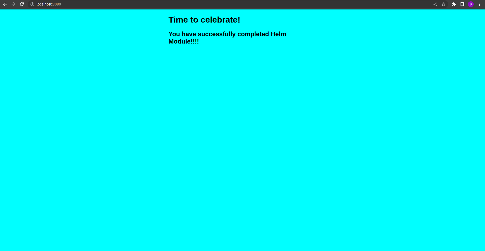

### **Task :**

https://github.com/infracloudio/citadel-internal/tree/master/workshops/helm#assignment

---

1. Files which are created as per mention in the task :
   - templates/configmap.yaml
   - templates/service.yaml
   - templates/deployment.yaml
   - templates/serviceaccount.yaml
   - templates/_helpers.tpl
   - values.yaml

2. Resource created after installation
    ```bash
    bhagyesh@BHAGYESH-SONI:~/helm_assignment$ k get all,cm,sa | grep nginx-webapp-helm-module
    pod/nginx-webapp-helm-module-5697bf8555-zhprn   1/1     Running   0             8m28s
    service/nginx-webapp-helm-module   ClusterIP   10.96.140.47   <none>        80/TCP     8m29s
    deployment.apps/nginx-webapp-helm-module   1/1     1            1           8m29s
    replicaset.apps/nginx-webapp-helm-module-5697bf8555   1         1         1       8m29s
    configmap/nginx-webapp-helm-module        1      8m29s
    serviceaccount/nginx-webapp-helm-module   0         8m29s
    ```
3. Exposed pod through port-forwarding and able to access on localhost
    ```bash
    bhagyesh@BHAGYESH-SONI:~/helm_assignment$ k port-forward nginx-webapp-helm-module-5697bf8555-zhprn 8080:80
    Forwarding from 127.0.0.1:8080 -> 80
    Forwarding from [::1]:8080 -> 80
    Handling connection for 8080
    Handling connection for 8080
    ```
    